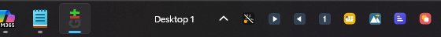

# DeskPilot

An AutoHotkey v2 companion for Windows 11 virtual desktops: always see which
desktop you are on, and move windows between desktops with hotkeys, mouse or
per-window rules.




## Features

- **OSD on every desktop switch** — a dark overlay briefly shows the desktop
  number and name (e.g. `3 · Klinik`) on the monitor where your mouse is.
- **Numbered tray icon** — always shows the current desktop number (1–9).
- **Taskbar name label** — the desktop name rendered clock-style directly on
  the taskbar, left of the notification area. Survives taskbar clicks,
  auto-hide and Explorer restarts.
- **Hotkeys** (all configurable) following one principle — *Ctrl = switch,
  Alt = move the window, Ctrl+Alt = move and follow*:

  | Keys | Action |
  |---|---|
  | `Win+Ctrl+←/→` | Switch desktop (native Windows) |
  | `Win+Alt+←/→` | Move the active window to the previous/next desktop |
  | `Win+Ctrl+Alt+←/→` | Move the window and follow it |
  | `Win+Ctrl+1–9` | Switch to desktop N |
  | `Win+Alt+1–9` | Move the active window to desktop N |
  | `Win+Ctrl+Alt+1–9` | Move the window to desktop N and follow |
  | `Win+Alt+↓` | Open the move menu for the active window (Alt+Tab friendly) |

- **Mouse control** — scroll the mouse wheel over the taskbar to switch
  desktop; two optional tray arrow icons switch on click.
- **Title bar menu** — right-click any window's title bar to get the window's
  *real* system menu (including items added by the app itself or tools like
  PowerToys) with three extra items at the bottom: move to desktop, move and
  follow, and *always move windows like this* (creates a rule).
- **Window rules** — regex rules that automatically move matching windows to
  a given desktop the moment they appear or change title.
- **IPC** — other scripts can control desktops via a window message (see below).

## Requirements

- Windows 11 (developed and tested on build 22631 / 23H2).
- [AutoHotkey v2](https://www.autohotkey.com/) — the Microsoft Store edition
  works fine.
- [VirtualDesktopAccessor.dll](https://github.com/Ciantic/VirtualDesktopAccessor)
  by Jarkko Pöyry (Ciantic), MIT licensed — required for *moving windows* and
  used for fast switching. Direct download of the latest build:
  **<https://github.com/Ciantic/VirtualDesktopAccessor/releases/latest/download/VirtualDesktopAccessor.dll>**

  The dll is *not* included in this repository. Without it everything except
  window moves still works; switching falls back to sending `Ctrl+Win+arrow`.

## Installation

1. Clone or download this repository.
2. Download `VirtualDesktopAccessor.dll` (link above) and place it next to
   `DeskPilot.ahk`.
3. Run `DeskPilot.ahk`. A default config file is created on first start.
4. Optional autostart: put a shortcut to the script in the folder that opens
   when you run `shell:startup`.
5. The two arrow icons start hidden in the tray overflow — open the `^`
   chevron and drag them onto the taskbar once; Windows remembers.

## Configuration

`DeskPilot config.ini` lives next to the script (UTF-16 LE —
keep that encoding; the Windows ini API requires it for non-ASCII text).
Edit it via the tray menu (*Open configuration*) and reload with
*Reload configuration* — no restart needed. The UI language (English or
Swedish) is switchable directly from the tray menu.

Hotkey syntax is AutoHotkey's: `+` Shift, `^` Ctrl, `#` Win, `!` Alt, then a
key name (`Right`, `F13`, `Numpad1`…). An empty value disables that binding.

| Section | Key | Default | Meaning |
|---|---|---|---|
| `[Hotkeys]` | `MoveNext` / `MovePrevious` | `!#Right` / `!#Left` | Move the active window one desktop right/left |
| | `MoveFollowNext` / `MoveFollowPrevious` | `^!#Right` / `^!#Left` | Same, but switch along and refocus the window |
| | `SwitchToPrefix` | `^#` | Prefix combined with digits 1–9: switch to desktop N |
| | `MoveToPrefix` | `!#` | Prefix + digit: move the window to desktop N |
| | `MoveFollowToPrefix` | `^!#` | Prefix + digit: move and follow |
| | `MoveMenu` | `!#Down` | Opens the move menu for the active window |
| | `ShowName` | *(empty)* | Optional hotkey that shows the OSD |
| `[Display]` | `Language` | `en` | UI language: `en` or `sv` (also in the tray menu) |
| | `NameInTray` | `1` | Desktop name as text on the taskbar |
| `[Mouse]` | `Wheel` | `1` | Mouse wheel over the taskbar switches desktop |
| | `ArrowIcons` | `1` | The two clickable tray arrows |
| | `TitleMenu` | `1` | Right-click title bar menu |
| | `TitleMenuExclude` | *(empty)* | Process regex: apps whose title clicks are left completely untouched (menu via Shift+right-click instead) |
| | `TitleMenuBand` | `(?i)^olk\.exe$` | Process regex: apps whose custom title bars report client area everywhere (new Outlook) — plain right-click in the top ~44 px band shows the menu anyway |
| `[Rules]` | `RuleN` | — | Auto-move rules, see below |

> **Note:** the digit prefixes override two Windows taskbar shortcuts for
> pinned apps: `Win+Ctrl+digit` (switch to app N) and `Win+Alt+digit` (jump
> list). Empty the prefix values if you prefer to keep those.
> Avoid `^!` *alone* as a prefix — that is AltGr, and it breaks characters
> like `@` on non-US layouts.

### Window rules and how the regex settings work

A rule automatically moves matching windows to a desktop. Format:

```ini
[Rules]
Rule1=3 (?i)^patienthistorik
Rule2=2 Spotify
```

`RuleN=<desktop number> <regex>` — one space between the number and the
regex; everything after that space is the pattern, matched against window
*titles*.

The easiest way to create a rule is the title bar menu: right-click a window
title → *Flytta alltid "…" till* → pick a desktop. A dialog opens with the
regex pre-filled as the exact current title, anchored and escaped
(`^Exact title$`) — edit it there before saving.

Regex facts that matter here (AutoHotkey uses PCRE):

- **Unanchored patterns match anywhere in the title.** `Spotify` matches any
  title containing the word. Use `^` (start) and `$` (end) to demand exact
  position: `^Spotify Premium$` matches only that exact title.
- **Matching is case-sensitive by default.** Prefix with `(?i)` to make it
  case-insensitive: `(?i)^patienthistorik` matches `Patienthistorik – Eva…`.
- **`.` matches any character, `.*` any sequence.** `^LIMS.*Prov` matches
  titles starting with `LIMS` that later contain `Prov`.
- **Escape special characters** (`. ( ) [ ] { } + * ? | ^ $ \`) with a
  backslash when you mean them literally — the pre-filled rule does this for
  you.
- **AutoHotkey's `\w` is ASCII-only** — it does *not* match å, ä, ö. Write
  `[\wåäöÅÄÖ]` when you need word characters including Swedish letters.
- A rule only fires when a window is *new* or its title *changes into*
  matching — so if you manually drag a rule window elsewhere it stays there.
  All existing windows are evaluated once when the script starts.

`TitleMenuExclude` and `TitleMenuBand` use the same regex flavor but match
**process executable names** (e.g. `msedge.exe`), not titles. Example: to
keep Edge's own title bar menu on plain right-click, set
`TitleMenuExclude=(?i)^(msedge|chrome)\.exe$` — the move menu is then still
available with Shift+right-click.

## The title bar menu

The menu you get on right-click is the window's **real** system menu shown by
this script (the same technique Explorer uses for taskbar thumbnail menus),
so anything other software injects — PowerToys' *Always on top*, Edge's
vertical-tabs toggles — appears and works. The desktop items are appended
while the menu is open and removed afterwards. Right-clicking again while
the menu is open closes it.

Apps whose custom title bars only report a thin caption strip (VS Code) work
best with a click on the upper edge; Shift+right-click accepts the whole top
band of any window as title bar.

## IPC

Other programs can control DeskPilot by posting the registered window
message `DESKPILOT_CMD` to the script's hidden main window:

| wParam | Action |
|---|---|
| 1 | Switch to desktop `lParam` |
| 2 | Move the active window to desktop `lParam` |
| 3 | Move and follow to desktop `lParam` |
| 4 | Show the name OSD |
| 5 | Reload the configuration |
| 6 / 7 | Next / previous desktop |
| 100 | Ping — writes `ping.txt` next to the script (test hook) |

```autohotkey
; AutoHotkey v2 example
msg := DllCall("RegisterWindowMessage", "str", "DESKPILOT_CMD", "uint")
DetectHiddenWindows true
SetTitleMatchMode 2
PostMessage(msg, 1, 3, , WinExist("DeskPilot.ahk ahk_class AutoHotkey"))
```

## How it works

- **Detection** polls Explorer's own registry values every 250 ms
  (`HKCU\…\Explorer\VirtualDesktops`) — no undocumented COM interfaces, so it
  survives Windows updates. Desktop names come from the same place.
- **Window moves** use VirtualDesktopAccessor.dll, because the documented
  `IVirtualDesktopManager::MoveWindowToDesktop` refuses windows belonging to
  other processes (`E_ACCESSDENIED`).
- **The taskbar label** is a tiny transparent window made a *child* of the
  taskbar (`SetParent` into `Shell_TrayWnd`), which is why it never ends up
  behind the taskbar and follows auto-hide for free.
- **Command-line switches**: `/selftest` writes the parsed state and
  registered hotkeys to `selftest.txt` and exits; `/show` shows the OSD at
  startup.

## Limitations

- Desktops beyond 9 get a generic tray icon and no digit hotkeys.
- Tested on Windows 11 23H2 (build 22631) with the Windows 11 taskbar.
  The taskbar label anchors to `TrayNotifyWnd1`, which may move in future
  Windows builds.
- No wrap-around at the first/last desktop (matching Windows' own behavior).

## Credits

- [VirtualDesktopAccessor](https://github.com/Ciantic/VirtualDesktopAccessor)
  by Jarkko Pöyry — the dll that makes cross-process window moves possible.

## License

MIT — see [LICENSE](LICENSE).
